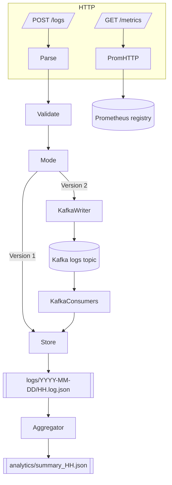

# Log Pipeline

A Go service that ingests batched web logs, persists them to hourly NDJSON files, produces hourly analytics, and exposes Prometheus metrics. Two deployment modes run in the same codebase:
- **Version 1:** synchronous HTTP → file writes.
- **Version 2:** HTTP → Kafka (async) → consumer workers → file storage.

## Table of Contents
- [Overview](#overview)
- [Thought Process](#thought-process)
- [Technology Choices](#technology-choices)
- [Design Decisions](#design-decisions)
- [Requirement Fulfillment](#requirement-fulfillment)
- [Usage](#usage)
- [Testing & Load](#testing--load)
- [Profiling](#profiling)
- [System Architecture (Mermaid)](#system-architecture-mermaid)
- [Future Work](#future-work)

## Overview
- **Log ingestion:** `POST /logs` accepts JSON arrays or CSV batches (`timestamp`, `path`, `userAgent`). Validation is uniform across both versions.
- **Storage:** Records are appended to `logs/YYYY-MM-DD/HH.log.json` using NDJSON.
- **Aggregation:** Every 30s a background worker walks stored log files and summarizes each hour into `analytics/YYYY-MM-DD/summary_<HH>.json`, skipping hours whose summaries are already up to date.
- **Metrics:** `/metrics` exposes custom counters (`log_batches_received_total`, `invalid_requests_total`, `logs_ingested_total`, `ingest_errors_total`, `aggregation_runs_total`) plus a queue-depth gauge and Go/process runtime metrics.
- **Modes:** Version 1 writes directly to storage; Version 2 enqueues to Kafka and persists asynchronously via consumer goroutines.

## Thought Process
- Maintain a **clean separation of concerns** (domain interfaces, services, infrastructure) so that storage or queue implementations can change without touching business logic.
- Keep **HTTP latency low** by keeping handlers thin (parse + validate + delegate). For Version 2, Kafka’s async writer keeps tail latency minimal.
- Provide **observability hooks** from day one: Prometheus metrics, structured logs, and on-disk analytics artifacts.
- Support **local + container workflows** so developers can test either in Docker or on bare metal while watching stdout logs.

## Technology Choices
- **Go 1.23+** with toolchain auto-upgrade (`GOTOOLCHAIN=auto`) for modern language features and reproducible builds.
- **Standard library HTTP** (`net/http`, `encoding/json`, `encoding/csv`) for portability and fewer dependencies.
- **`github.com/segmentio/kafka-go`** for Kafka producer/consumer abstractions.
- **`github.com/prometheus/client_golang`** for metrics and collectors.
- **Docker Compose** to spin up Kafka + Prometheus + both app versions (or just infra).

## Design Decisions
- **Packages**
  - `cmd`: entrypoint wiring.
  - `cmd/bootstrap`: CLI parsing, logger/observability wiring, and app assembly.
  - `internal/domain`: `LogRecord`, `LogStore`, `LogQueue` definitions.
  - `internal/service`: ingestion orchestration (mode-aware) and aggregation worker.
  - `internal/http`: handlers and routing.
- `repo`: file-based repository (mutex per file path, NDJSON writes).
- `model`: shared types (`LogRecord`, `LogQueue`, `ConsumedMessage`).
  - `internal/queue`: `NoopQueue` (v1) + Kafka implementation (v2).
  - `internal/metrics`: counters, Go/process collectors with idempotent registration.
- **Configuration**
  - Flags/env for quick overrides (e.g., `-version`, `HTTP_ADDR`, `KAFKA_BROKERS`).
- YAML config (`-config=...`) to set server, directories, aggregation interval, Kafka settings. Samples in `config/examples/` for Docker and local runs.
- **Aggregation**
  - Only processes the **current UTC hour** to avoid re-reading all history.
  - Writes summaries with RFC3339 hour identifier and nested maps for counts.
- **Docker Compose**
  - `confluentinc/cp-kafka:7.5.0` (KRaft) with host listener `localhost:19092`.
  - `prom/prometheus` scraping app containers (`app-v1:8082`, `app-v2:8083`).
  - `stack-up` target builds images, runs services, and auto-creates Kafka topic `logs`.

## Requirement Fulfillment
| Feature | Version 1 | Version 2 |
|---------|-----------|-----------|
| Batch JSON/CSV ingestion | ✅ direct file write | ✅ enqueue to Kafka |
| Hourly NDJSON storage | ✅ | ✅ (consumer writes) |
| Aggregation summaries | ✅ `analytics/summary_<HH>.json` | ✅ same worker |
| Prometheus metrics | ✅ `/metrics` | ✅ `/metrics` |
| Kafka scalability | — | ✅ async writer + consumer group |
| Config via flags/YAML | ✅ | ✅ |
| Docker stack | ✅ | ✅ |
| Makefile automation | ✅ | ✅ |

## Usage

### Prerequisites
- Go 1.23+
- Docker & docker-compose (for Kafka/Prometheus stack)
- `hey` (optional) for load testing

### Common Make Targets
| Target | Description |
|--------|-------------|
| `make build` | build `bin/server` |
| `make run-v1` | run Version 1 locally (`-version=1`) |
| `make run-v2` | run Version 2 locally (needs Kafka; uses `config/examples/config.v2.local.yaml`) |
| `make stack-up` | build & run Kafka + Prometheus + app v1/v2 containers; ensure `logs` topic |
| `make stack-down` | tear down stack |
| `make infra-up` | run Kafka + Prometheus only (app runs outside Docker) |
| `make infra-down` | stop Kafka + Prometheus |
| `make loadtest-v1` | `hey` against `http://localhost:8082/logs` (default v1 addr) |
| `make loadtest-v2` | `hey` against `http://localhost:8083/logs` |
| `make kafka-topic` | idempotently create `logs` topic |

### Running Version 1 locally
```bash
make run-v1
curl -X POST -H "Content-Type: application/json" \
     -d @testdata/sample_logs.json \
     http://localhost:8082/logs
```
Hourly files: `logs/YYYY-MM-DD/HH.log.json`, analytics: `analytics/summary_HH.json`.

### Running Version 2 locally (app outside Docker)
```bash
make infra-up            # starts Kafka (localhost:19092) + Prometheus
make run-v2              # uses config/examples/config.v2.local.yaml
curl -X POST -H "Content-Type: application/json" \
     -d @testdata/sample_logs.json \
     http://localhost:8083/logs
```
Analytics land in `./analytics`. Stop infra with `make infra-down`.

### Dockerized stack
```bash
make stack-up
# v1 on http://localhost:8082, v2 on http://localhost:8083, Prometheus on http://localhost:9090
make stack-down
```

## Testing & Load
- `make test` → `go test ./...` (unit tests for ingestion mode routing and aggregation summarization).
- `make loadtest-v1` / `make loadtest-v2` → run `hey` against each version. Adjust `testdata/sample_logs.json` timestamps to current UTC hour if you want immediate aggregation output.

## Profiling

There are two options:

1. **Automatic capture via env-controlled profiling** – wrap the entire server lifecycle and write CPU/heap profiles to disk.
2. **Live pprof server** – expose `/debug/pprof/**` endpoints for ad-hoc sampling.

### 1. Automatic capture

Set `PROFILE_CAPTURE=1` (optionally `PROFILE_NAME`, `PROFILE_DIR`) to enable code-driven CPU/heap/goroutine profiles. Use the provided make targets:

```bash
make capture-profile-v1   # runs version 1, writes profiles/cpu_v1.prof, heap_v1.prof, goroutine_v1.prof
make capture-profile-v2   # runs version 2, writes profiles/cpu_v2.prof, heap_v2.prof, goroutine_v2.prof
```

Drive load while the server runs (e.g., `make loadtest-v1` / `make loadtest-v2`), then stop the server (Ctrl+C). Profiles are saved under `profiles/`. Inspect or compare them with:

```bash
make profile-ui-cpu-v1        # serves latest v1 CPU profile at http://localhost:8085
make profile-ui-cpu-v2        # serves latest v2 CPU profile at http://localhost:8086
make profile-ui-cpu-compare   # compares CPU profiles at http://localhost:8087
make profile-ui-heap-compare  # compares heap profiles at http://localhost:8088
make profile-ui-goroutine-compare # compares goroutine profiles at http://localhost:8089
```

### 2. Live pprof server

For on-demand sampling, enable the HTTP profiler: `PROFILE_ENABLED=1 PROFILE_ADDR=:6062 ./bin/server ...`. Or use the helpers:

```bash
make profile-run-v1          # starts v1 with pprof server (default :6062)
make profile-run-v2          # starts v2 with pprof server (default :6063)
```

Then run the `profile-*` curl-based targets to capture individual CPU/heap/goroutine snapshots as before.

These commands invoke `go tool pprof` against the running pprof server (defaults to `http://localhost:6062` for v1, `:6063` for v2). Adjust `PPROF_ADDR_V1`, `PPROF_ADDR_V2`, or `PPROF_SECONDS` in the Makefile/command line if you need different ports or sampling windows.

## System Architecture (Mermaid)


## Future Work
| Area | Idea | Rationale |
|------|------|-----------|
| API | `GET /analytics?hour=` endpoint | Serve summaries directly without touching disk |
| Aggregation | Track file offsets / process multi-hour windows | Reduce re-reading & allow backfill |
| Storage | Pluggable backends (S3, DB) | Swap in remote storage without changing ingestion code |
| Queue | Retry / dead-letter handling | Currently drops after logging error |
| Metrics | Kafka lag gauges, histogram for `/logs` latency | Deeper observability |
| Tests | Docker-based integration test for Kafka path | End-to-end verification in CI |
