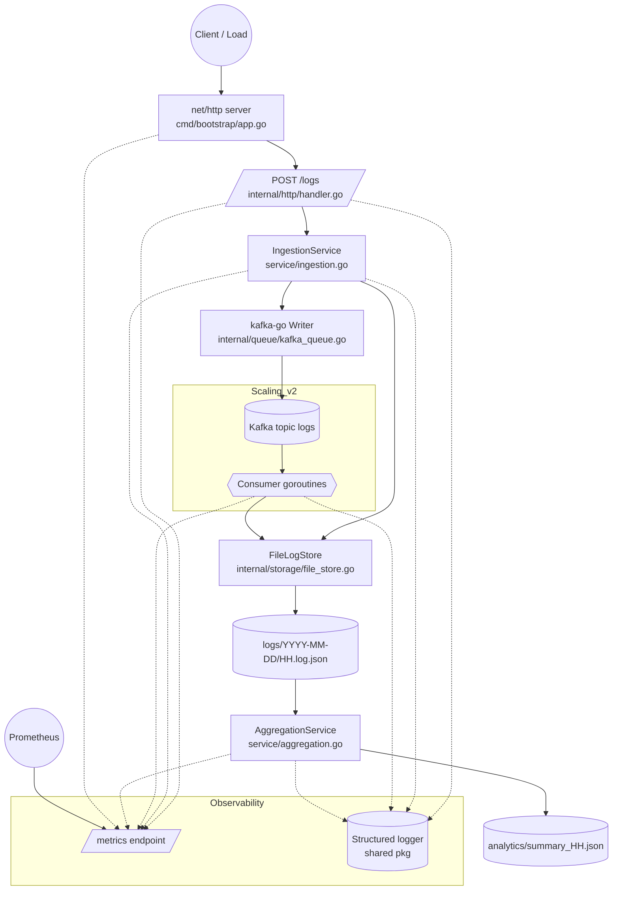

```mermaid
flowchart TD
    Client((Client / Load))
    HTTP[net/http server\ncmd/bootstrap/app.go]
    LogsHandler[/POST /logs\ninternal/http/handler.go/]
    Ingestion[IngestionService\nservice/ingestion.go]
    Store[FileLogStore\ninternal/storage/file_store.go]
    KafkaWriter[kafka-go Writer\ninternal/queue/kafka_queue.go]
    Kafka[(Kafka topic logs)]
    Consumers{{Consumer goroutines}}
    NDJSON[(logs/YYYY-MM-DD/HH.log.json)]
    Aggregator[AggregationService\nservice/aggregation.go]
    Analytics[(analytics/summary_HH.json)]
    PromScraper((Prometheus))
    Metrics[/metrics endpoint/]
    Logger[(Structured logger\nshared pkg)]

    Client --> HTTP
    HTTP --> LogsHandler
    LogsHandler --> Ingestion
    Ingestion --> Store
    Ingestion --> KafkaWriter
    KafkaWriter --> Kafka
    Kafka --> Consumers
    Consumers --> Store
    Store --> NDJSON
    NDJSON --> Aggregator
    Aggregator --> Analytics

    subgraph Observability
        Metrics
        Logger
    end

    LogsHandler -.-> Metrics
    Ingestion -.-> Metrics
    Consumers -.-> Metrics
    Aggregator -.-> Metrics
    HTTP -.-> Metrics
    PromScraper --> Metrics

    LogsHandler -.-> Logger
    Ingestion -.-> Logger
    Consumers -.-> Logger
    Aggregator -.-> Logger

    subgraph Scaling_v2
        Kafka
        Consumers
    end

```
